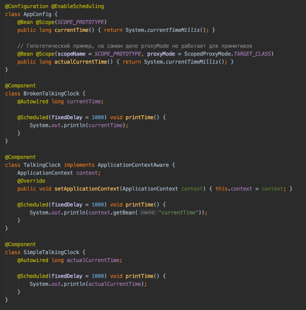

### Как работает инъекция прототипа в синглтон?

Раньше мы уже рассматривали различия скоупов singleton и prototype в Spring Framework. Допустим ситуацию,
когда в singleton-компонент внедряется зависимость со скоупом prototype – когда будет создан её объект?

Если просто добавить к определению бина аннотацию @Scope(SCOPE_PROTOTYPE), и использовать этот бин в синглтоне через аннотацию
@Autowired – будет создан только один объект. Потому что синглтон создается только однажды, и обращение к прототипу случится тоже однажды при его создании
при внедрении зависимости).

Примитивный способ получать новый объект при каждом обращении – отказаться от @Autowired, и доставать его из контекста вручную. Для этого нужно вызывать
context.getBean(MyPrototype.class).

Воспользоваться автоматическим внедрением зависимостей можно через внедрение метода (паттерн «Команда»). Автовайрится не сам объект, а производящий его метод.

Более красивый декларативный способ – правильно настроить определение бина. В аннотации @Scope кроме самого scopeName доступен второй параметр – proxyMode.
По умолчанию его значение NO – прокси не создается. Но если указать INTERFACES или TARGET_CLASS, то под @Autowired будет внедряться не сам объект,
а сгенерированный фреймворком прокси.
И когда проксируемый бин имеет скоуп prototype, то объект внутри прокси будет пересоздаваться при каждом обращении.

