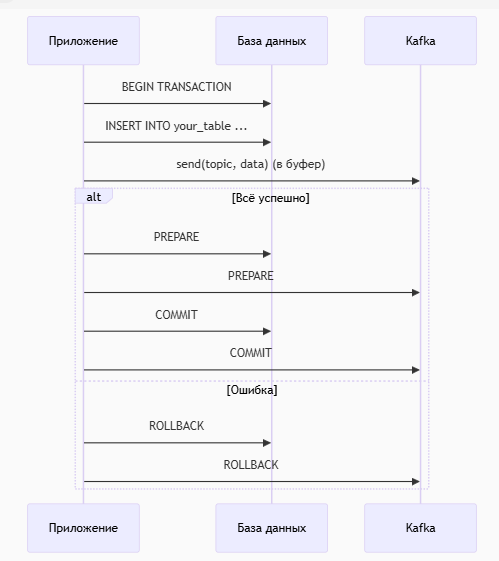

###         1. Начало транзакции

Когда вызывается метод saveToDbAndKafka():
Spring создает новую транзакцию (если нет активной) через PlatformTransactionManager.

Транзакция регистрируется в текущем контексте (ThreadLocal).

###       2. Работа с базой данных
Запрос выполняется в рамках начатой транзакции.
Изменения не фиксируются в БД сразу — они временно сохраняются в транзакционном буфере.

###       3. Отправка сообщения в Kafka
Spring Kafka интегрируется с транзакцией через KafkaTransactionManager.

Сообщение не отправляется в Kafka сразу, а добавляется в транзакционный буфер Kafka.

Если Kafka недоступна, выбросится RuntimeException, и транзакция откатится.

###         4. Завершение метода
Если код выполнился без исключений:
Spring инициирует двухфазный коммит (2PC):

Подготовка (Prepare):
БД и Kafka получают запрос "готовы ли зафиксировать изменения?".

Фиксация (Commit):
Если все участники подтвердили готовность, изменения фиксируются:

Данные записываются в БД.
Сообщение публикуется в Kafka.

Если возникло исключение:

Все участники (БД и Kafka) получают команду отката.

## Ограничения подхода
Требуется поддержка транзакций в Kafka (версии 0.11+).

Нет защиты от сбоев после коммита:

Если БД зафиксировала изменения, но Kafka не успела, возможна рассогласованность (Outbox решает эту проблему).

Блокировки в БД на время отправки в Kafka.