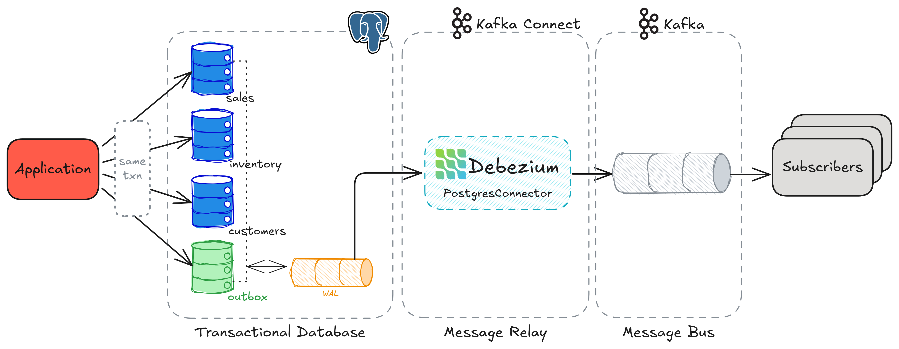

1. Kafka Connect

Инструмент для интеграции Kafka с внешними системами. 
Работает как "мост" между Kafka и другими источниками/приемниками данных.

Использует коннекторы (плагины) для разных систем (PostgreSQL, MySQL, S3, Elasticsearch и т.д.).
Поддерживает два режима:

- Source Connector – забирает данные из внешней системы в Kafka.
- Sink Connector – отправляет данные из Kafka во внешнюю систему.

2. Debezium

CDC-инструмент (Change Data Capture), который отслеживает изменения в базах данных (INSERT/UPDATE/DELETE) и
отправляет их в Kafka в реальном времени.

Читает журнал транзакций БД (WAL в PostgreSQL, binlog в MySQL).
Преобразует изменения в события (например: {"id": 1, "name": "New Order"}).
Отправляет события в Kafka.

### WAL
WAL — это механизм, используемый базами данных (PostgreSQL, MySQL, Oracle и др.) для гарантии сохранности данных и поддержки транзакций.
Перед тем как изменения попадут в саму БД, они сначала записываются в специальный журнал (лог). Это похоже на "черновик" для операций.

При изменении данных (INSERT/UPDATE/DELETE) БД сначала записывает операцию в WAL.

Пример: Если вы добавляете новый заказ в таблицу orders, в WAL появится запись:
[Транзакция 123] INSERT INTO orders (id, product) VALUES (1, 'Laptop');

Фиксация в БД:
Только после записи в WAL изменения применяются к основным таблицам.

Восстановление при сбое: Если БД упала до завершения операции, при перезапуске она "доделает" изменения из WAL.

### Преимущества
- Полная декoupling
    Приложение не зависит от Kafka.
    Изменения в брокере или формате сообщений не требуют правок кода.

- Нулевая нагрузка на приложение.
  Отправка в Kafka выполняется асинхронно через Kafka Connect.
  Нет блокирующих вызовов или ручного управления ретраями.

- Гибкая маршрутизация событий.
Debezium трансформации (EventRouter).
позволяют направлять события в разные топики на основе полей (aggregate_type, event_type).

- Автоматическое масштабирование.
Можно увеличивать количество партиций Kafka и коннекторов без изменений кода.

### Недостатки

- Задержка доставки.

    События появляются в Kafka не мгновенно (обычно 100–500 мс).
    Не подходит для систем с жесткими real-time требованиями.

- Дополнительная нагрузка на БД.

    Debezium создает репликационные слоты в PostgreSQL, что увеличивает нагрузку.
    Требуется мониторинг WAL-логов и дискового пространства.

- Требуется точная настройка Exactly-Once.

    Для гарантии исключения дублей нужно настраивать идемпотентность на стороне консьюмеров.

- Зависимость от инфраструктуры.

    При падении Kafka Connect или Debezium новые события перестают отправляться.
    Необходим мониторинг и автоматическое восстановление.
